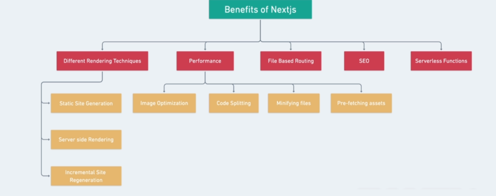
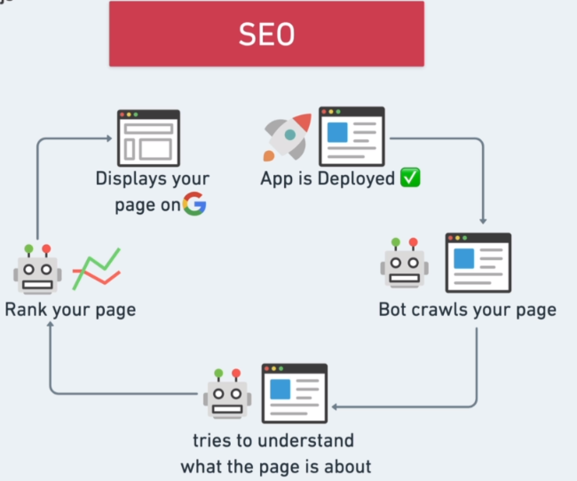
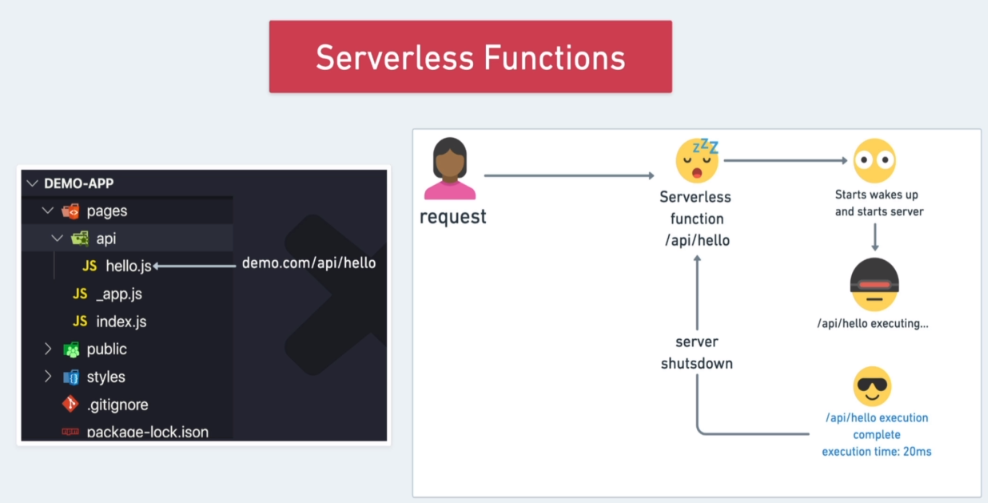

# Next.js Fundamentals

1. What is Next.js?
2. Benefits or Adavantages of Next.js over React.js?
3. Why is Next.js so popular?

1. What is Next.js?

    - It is a framework build on ```top of React``` that gives you the ```flexibility``` of building scalable apps by allowing you to ```render content on the server```.

    - It is a framework that allows you to build react apps but render content on the server in advance.

    - Next.js is a ```FULL STACK``` framework.

    - You won't just be building the frontend of the application, but also the backend as well, because ```next.js``` provides us with  a ```node.js server out of the box```.

    - in React, you always render content on the ```client```. There is no server.

    - But with next.js, you can choose to do that on the ```client```, on the ```server``` or a ```mix of both```, you can choose to render on client in your browser on one page, but as choose to do something else on the server on another page next.js is a really flexible, And this is why you are able to build really scalable and highly performant applications because of this ```hybrid approach```.

2. Benefits or Advantages of Next.js?



3. Performance with Next.js:

    - ```Code Splitting```

        - It means dividing our web app in ```small chunks``` so we can only load the chunk that is used by the current page.
    
    - ```Image Optimization```

        - next ```Iamge``` component

        - Image component from next.js and will serve an image based on the browser size. So if we are on a mobile device, we will see a smaller image instead and If we are on a desktop, then we essentially see a much larger image.

4. Image component with Next.js:

    - 

5. File Based Routing and SEO:



6. Serverless Functions in Next.js:




    

