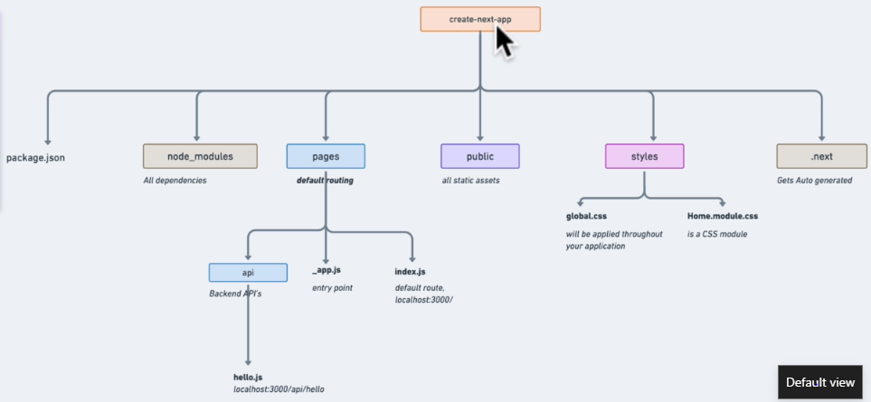

# First Next.js App | Coffee Connoisseur

1. create-next-app:

    - https://nextjs.org/docs/getting-started

    - Install Tailwind CSS with Next.js

        - https://tailwindcss.com/docs/guides/nextjs
    
    - Upgrade Guide:

        - https://nextjs.org/docs/upgrading

2. Features of Next.js 12:

    - https://nextjs.org/blog/next-12

3. Folder Structure of create-next-app:



4. ```Fast Refresh``` in Next.js:

    - https://nextjs.org/docs/basic-features/fast-refresh

5. What are ```CSS Modules```?

    - https://github.com/css-modules/css-modules

6. Creating a ```background``` for the Application:

    - https://meshgradient.com/

    - 

